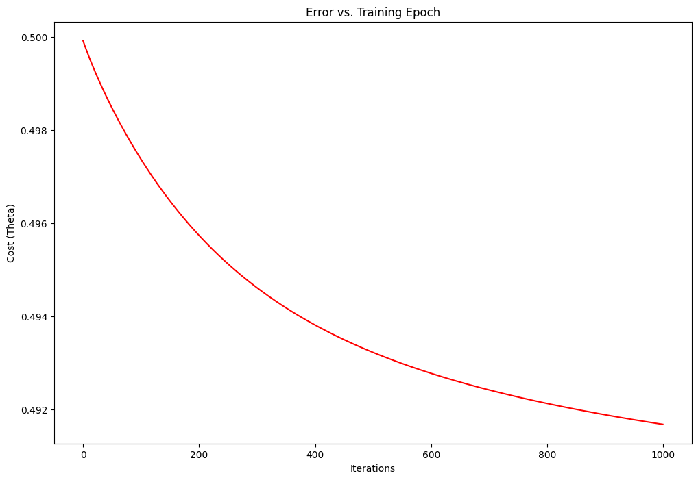

## Projekt: Lineární regrese

Tento projekt vznikl jako součást předmětu **Strojové učení (SU)**. Cílem je zvolený dataset zpracovat libovolnou metodou strokjového učení. Projekt využívá dataset kvality ovzduší a je implementován v prostředí **Jupyter Notebook**.

## Dataset

Použitý dataset: [`AirQualityUCI.csv`](AirQualityUCI.csv)  
Dataset obsahuje měření kvality ovzduší (oxid uhelnatý, oxidy dusíku, O3, teplota, vlhkost aj.). Má 9357 řádků a 15 sloupců.  
Zdroj: [UCI Machine Learning Repository](https://archive.ics.uci.edu/dataset/360/air+quality)

## Obsah notebooku

- Načtení a předzpracování dat
- Implementace metody gradient descent
- Výpočet nákladové funkce
- Vykreslení grafu

## Výsledek

Z grafu je patrné, že hodnota nákladové funkce (cost function) postupně klesá s rostoucím počtem iterací. Křivka má konvergenční charakter. To ukazuje, že algoritmus gradient descent funguje správně: optimalizuje parametry θ (theta) směrem k optimálním hodnotám a nákladová funkce klesá.

